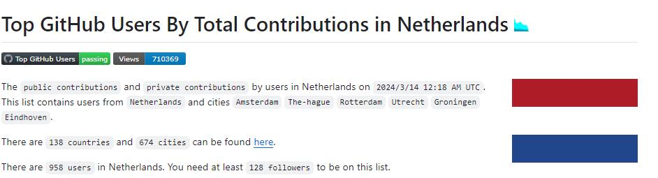

## Top Github Users


**Github repository:** [Top GitHub Users By Country](https://github.com/gayanvoice/top-github-users/tree/main)



I am delighted to announce that I have become one of the top 1000 GitHub users in the Netherlands.

```{r echo=FALSE, fig.height=4, fig.width=10, message=FALSE, warning=FALSE, paged.print=FALSE}
library(ggplot2)
library(plotly)

windowsFonts(RT = windowsFont("Times New Roman"))

rankingdf <- data.frame(Ranking = c(468, 641, 826),
                        Name = c('Public contribution',
                                 'Total contribution',
                                 'Follower'))


g1 <- ggplot(rankingdf) + 
  geom_bar(mapping = aes(x = Name, y = Ranking, fill = Name),
           stat = 'identity', position = 'dodge') +
  geom_text(mapping = aes(x = Name, y = Ranking, label = Ranking),
            nudge_x = 0.1, family = 'RT') + 
  labs(x = "", y = 'Rank', title = "", fill = '') + 
  scale_fill_manual(values = c("#eca680", 
                               "#f7df87",
                               "#54beaa"))+
  coord_flip() +
  theme(legend.position = 'bottom',
        panel.background = element_blank(),
        panel.border = element_rect(colour = 'black', fill = NA, size = 1),
        strip.background = element_blank(),
        text = element_text(family = 'RT', size = 16),
        title = element_text(family = 'RT', size = 18),
        strip.text = element_text(family = 'RT', size = 18))

ggplotly(g1)

```


